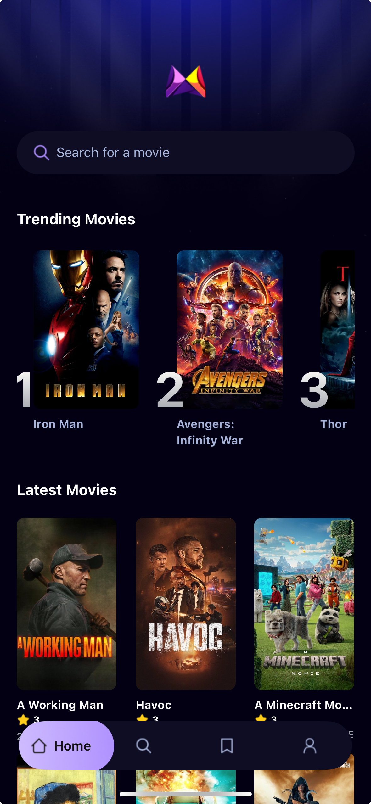

<a name="readme-top"></a>

<!-- PROJECT LOGO -->
<br />
<div align="center">
  <h3 align="center">Mobile Movie App</h3>
</div>

<!-- TABLE OF CONTENTS -->
<details>
  <summary>Table of Contents</summary>
  <ol>
    <li>
      <a href="#about-the-project">About The Project</a>
      <ul>
        <li><a href="#built-with">Built With</a></li>
      </ul>
    </li>
    <li><a href="#quick-start">Quick Start</a></li>
    <li><a href="#acknowledgments">Acknowledgments</a></li>
  </ol>
</details>

<!-- ABOUT THE PROJECT -->

## About The Project

<div align="center">
   
</div>

<p align="right">(<a href="#readme-top">back to top</a>)</p>

### Built With

- [![React Native][react native]][react native-url]
- [![Expo][Expo]][Expo-url]
- [![Typescript][Typescript]][Typescript-url]
- [![TailwindCSS][TailwindCSS]][TailwindCSS-url]
- [![appwrite][appwrite]][appwrite-url]

<p align="right">(<a href="#readme-top">back to top</a>)</p>

## Quick Start

<b>Installation</b>

Install the project dependencies using npm:

```
npm install
```

<b>Set Up Environment Variables</b>

Create a new file named .env in the root of your project and add the following content:
```
EXPO_PUBLIC_MOVIE_API_KEY=
EXPO_PUBLIC_APPWRITE_PROJECT_ID=
EXPO_PUBLIC_APPWRITE_DATABASE_ID=
EXPO_PUBLIC_APPWRITE_COLLECTION_ID=
```

Replace the placeholder values with your actual TMDB API key, Appwrite project ID, Database ID, and Collection ID. You can obtain these credentials by signing up on the Appwrite, TMDB.

<b>Running the Proj</b>ect

```
npx expo start
```

Open your ExpoGO app on your phone and scan the QR code to view the project.

<!-- ACKNOWLEDGMENTS -->

## Acknowledgments

- [ React Native Course for Beginners in 2025 | Build a Full Stack React Native App ](https://www.youtube.com/watch?v=f8Z9JyB2EIE)

<p align="right">(<a href="#readme-top">back to top</a>)</p>

<!-- MARKDOWN LINKS & IMAGES -->

[product-screenshot]: docs/img/screenshot.png
[Typescript]: https://img.shields.io/badge/TypeScript-007ACC?style=for-the-badge&logo=typescript&logoColor=white
[Typescript-url]: https://www.typescriptlang.org/
[react native]: https://img.shields.io/badge/reactnative-3DDC84?style=for-the-badge&logo=react&logoColor=white
[react native-url]: https://reactnative.dev/
[Expo]: https://img.shields.io/badge/Expo-000000?style=for-the-badge&logo=Expo&logoColor=white
[Expo-url]: https://expo.dev/
[TailwindCSS]: https://img.shields.io/badge/tailwindcss-38B2AC?style=for-the-badge&logo=tailwind-css&logoColor=white
[TailwindCSS-url]: https://tailwindcss.com/
[appwrite]: https://img.shields.io/badge/Appwrite-FD366E?style=for-the-badge&logo=appwrite&logoColor=white
[appwrite-url]: https://appwrite.io/
